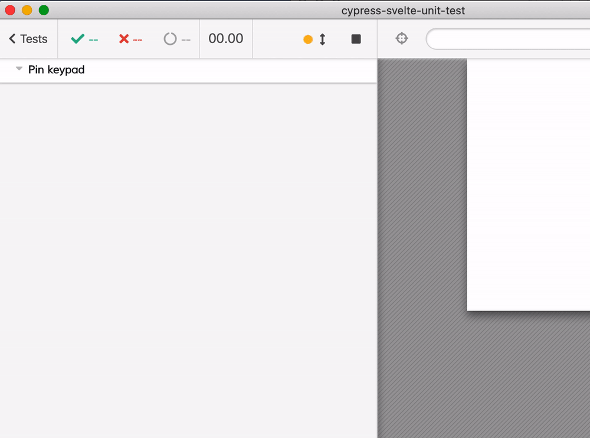
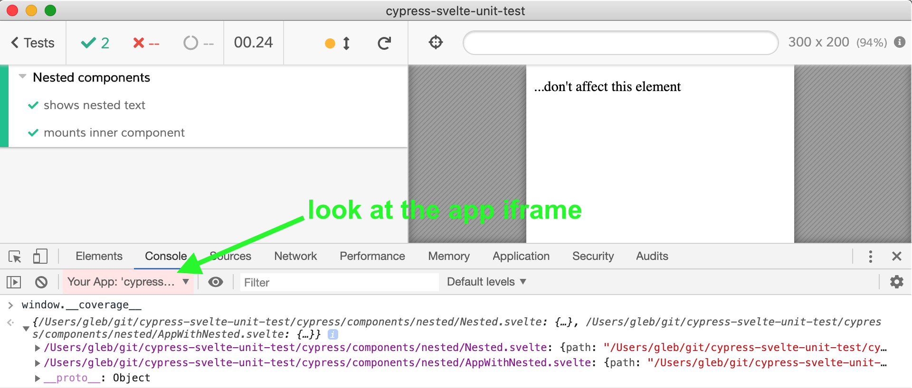
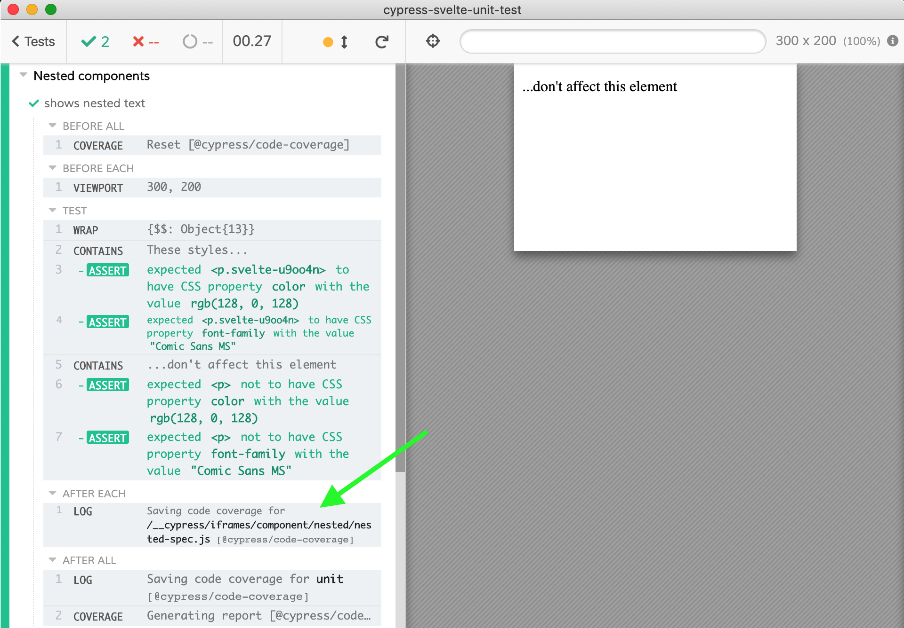
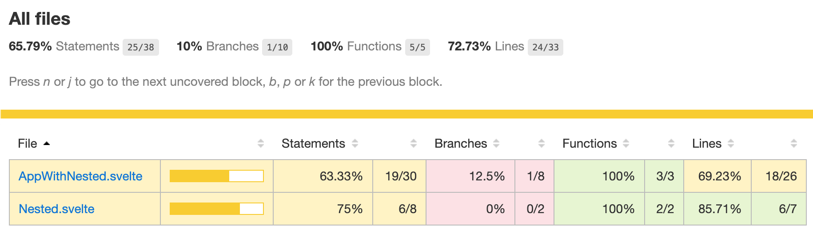
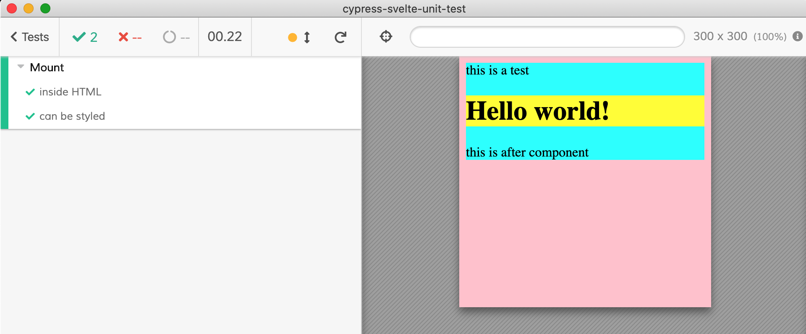

# cypress-svelte-unit-test [![CI][ci image]][ci url] [![circle image]][circle url]

[![renovate-app badge][renovate-badge]][renovate-app]  

> Component testing for Svelte apps using the open source [Cypress.io](https://www.cypress.io/) E2E test runner **v4.5.0+**



## Videos

I have recorded a series of short (3-4 minutes) videos showing Cypress + `cypress-svelte-unit-test` in action. See the [playlist](https://www.youtube.com/playlist?list=PLP9o9QNnQuAa50lwW3cUql5sgdKIWkapp)

- [Writing the first component test](https://youtu.be/f2y8DOAIVXY)
- [Pass props to the component](https://youtu.be/9PGqSON9cv8)
- [Testing message dispatch](https://youtu.be/bx9vJMO0tdQ)
- [Style component during testing](https://youtu.be/dchx_4Klyok)

## Install

Requires [Node](https://nodejs.org/en/) version 8 or above and Cypress v4.5.0+

```sh
# Install this plugin and test spec preprocessor
npm install --save-dev cypress-svelte-unit-test
# if Cypress is not installed already
npx install --save-dev cypress
```

1. Tell Cypress to use your `rollup.config.js` to bundle specs using [cypress/plugins/index.js](cypress/plugins/index.js):

```js
module.exports = (on) => {
  // @bahmutov/cy-rollup is already a dependency of cypress-svelte-unit-test
  const filePreprocessor = require('@bahmutov/cy-rollup')
  on('file:preprocessor', filePreprocessor())
}
```

2. ⚠️ Turn the experimental component support on in your `cypress.json`. You can also specify where component spec files are located. For example, to have them located in `src` folder use:

```json
{
  "experimentalComponentTesting": true,
  "componentFolder": "src",
  "testFiles": "**/*spec.js"
}
```

See [cypress.json](cypress.json) in this project.

3. Write a test!

```js
import HelloWorld from './HelloWorld.svelte'
import { mount } from 'cypress-svelte-unit-test'
it('shows greeting', () => {
  mount(HelloWorld, {
    props: {
      name: 'World',
    },
  })
  cy.contains('h1', 'Hello World!')
})
```

Watch [Writing the first component test](https://youtu.be/f2y8DOAIVXY)

## Known issues

- need to load images differently to transform relative paths

## Code coverage

### Instrument your code

See [rollup.config.js](rollup.config.js) how you can instrument source files. In short:

```js
// npm i -D rollup-plugin-istanbul
import istanbul from 'rollup-plugin-istanbul'
plugins: [
  istanbul({
    include: ['cypress/components/**'],
    exclude: ['**/*spec.js'],
  }),
]
```

In Cypress iframe you should see the code coverage object under `window.__coverage__`.



### Coverage report

To merge coverage and generate reports we need to use [@cypress/code-coverage](https://github.com/cypress-io/code-coverage) plugin.

```shell
npm i -D @cypress/code-coverage
```

Add it to your [cypress/support/index.js](cypress/support/index.js) file

```js
import '@cypress/code-coverage/support'
```

Add the plugin to your [cypress/plugins/index.js](cypress/plugins/index.js) file

```js
module.exports = (on, config) => {
  const filePreprocessor = require('@bahmutov/cy-rollup')
  on('file:preprocessor', filePreprocessor())

  require('@cypress/code-coverage/task')(on, config)
  // IMPORTANT to return the config object
  // with the any changed environment variables
  return config
}
```

After the tests finish, you should see messages in the Command Log



And find generated reports in `coverage` folder. For example, to open the HTML report

```shell
open coverage/lcov-report/index.html
```



**Warning:** I am not sure the coverage numbers are making 100% sense for Svelte files.

## Svelte v3

This component adaptor is meant for [Svelte v3](https://svelte.dev/blog/svelte-3-rethinking-reactivity). If you need Svelte v2 support, check out branch [svelte-v2](https://github.com/bahmutov/cypress-svelte-unit-test/tree/svelte-v2)

## Use

Import your Svelte component and mount using the provided function. Pass [component options](https://svelte.dev/docs#Creating_a_component) and global document options (like a global CSS)

### Props

```js
/// <reference types="cypress" />
import App from '../components/ChainedBalls.svelte'
import { mount } from 'cypress-svelte-unit-test'

describe('SVG animation', () => {
  it('shows chained balls', () => {
    cy.viewport(960, 500)
    const style = `
      line {
        stroke: gray;
        stroke-width: 2px;
      }
    `
    mount(
      App,
      {
        props: {
          width: 960,
          height: 500,
        },
      },
      { style },
    )
    cy.get('circle').should('have.length', 50)
  })
})
```

Watch [Pass props to the component](https://youtu.be/9PGqSON9cv8)

### Styles

You can use local styles, local CSS file path (relative to the the Cypress project root) or external stylesheets. See [styles example](cypress/components/styles). You can surround the component with HTML and mount the component into the element with ID "here", see [cypress/components/mount-html](cypress/components/mount-html)

```js
const props = {...}
mount(HelloWorld, props, {
  html: `
    <div class="test-page">
      this is a test
      <div id="here"></div>
      this is after component
    </div>
  `,
  style: `
    body {
      background: pink
    }
    .test-page {
      background: cyan
    }
    #here {
      background: yellow
    }
  `,
})
```



Watch [Style component during testing](https://youtu.be/dchx_4Klyok)

### Callbacks

You can listen for messages from the component by supplying an object of callbacks.

```js
mount(TodoItem, {
  props: {
    id: 'todo-id',
    text: 'write a test',
    complete: false,
  },
  callbacks: {
    remove: cy.stub().as('remove'),
    toggle: cy.stub().as('toggle'),
    'inner-message': cy.stub().as('inner-message'),
  },
})
```

See [cypress/components/callbacks](cypress/components/callbacks).

Watch [Testing message dispatch](https://youtu.be/bx9vJMO0tdQ)

## Examples

Svelte components copied from [https://svelte.dev/examples](https://svelte.dev/examples)

All components and tests are in [cypress/components](cypress/components) folder

<!-- prettier-ignore-start -->
Test | Description
--- | ---
[animation](cypress/components/animation) | Chained balls SVG animation
[callbacks](cypress/components/callbacks) | Listen for messages dispatched from the component
[global-handlers](cypress/components/global-handlers) | Attaches event listeners to `document` and `window`
[hello](cypress/components/hello) | Hello, component testing!
[image](cypress/components/image) | Loading Rick-Roll image
[named-exports](cypress/components/named-exports) | Nice Audio player test
[nested](cypress/components/nested) | Checking nested components and local styles
[pin](cypress/components/pin) | Keypad pin test
[reactive](cypress/components/reactive) | Svelte reactive props, declarations and statements
[rx](cypress/components/rx) | Fetching GitHub users as a reactive stream
[styles](cypress/components/styles) | Shows inline, CSS and external stylesheet styles in spec
[tutorial](cypress/components/tutorial) | A few components and tests from Svelte tutorial
<!-- prettier-ignore-end -->

## Related tools

Same feature for unit testing components from other framesworks using Cypress

- [cypress-vue-unit-test](https://github.com/bahmutov/cypress-vue-unit-test)
- [cypress-react-unit-test](https://github.com/bahmutov/cypress-react-unit-test)
- [cypress-cycle-unit-test](https://github.com/bahmutov/cypress-cycle-unit-test)
- [cypress-svelte-unit-test](https://github.com/bahmutov/cypress-svelte-unit-test)
- [cypress-angular-unit-test](https://github.com/bahmutov/cypress-angular-unit-test)
- [cypress-hyperapp-unit-test](https://github.com/bahmutov/cypress-hyperapp-unit-test)
- [cypress-angularjs-unit-test](https://github.com/bahmutov/cypress-angularjs-unit-test)

### Small print

Author: Gleb Bahmutov &lt;gleb.bahmutov@gmail.com&gt; &copy; 2018

- [@bahmutov](https://twitter.com/bahmutov)
- [glebbahmutov.com](https://glebbahmutov.com)
- [blog](https://glebbahmutov.com/blog)

License: MIT - do anything with the code, but don't blame me if it does not work.

Support: if you find any problems with this module, email / tweet /
[open issue](https://github.com/bahmutov/cypress-svelte-unit-test/issues) on Github

## MIT License

Copyright (c) 2018 Gleb Bahmutov &lt;gleb.bahmutov@gmail.com&gt;

Permission is hereby granted, free of charge, to any person
obtaining a copy of this software and associated documentation
files (the "Software"), to deal in the Software without
restriction, including without limitation the rights to use,
copy, modify, merge, publish, distribute, sublicense, and/or sell
copies of the Software, and to permit persons to whom the
Software is furnished to do so, subject to the following
conditions:

The above copyright notice and this permission notice shall be
included in all copies or substantial portions of the Software.

THE SOFTWARE IS PROVIDED "AS IS", WITHOUT WARRANTY OF ANY KIND,
EXPRESS OR IMPLIED, INCLUDING BUT NOT LIMITED TO THE WARRANTIES
OF MERCHANTABILITY, FITNESS FOR A PARTICULAR PURPOSE AND
NONINFRINGEMENT. IN NO EVENT SHALL THE AUTHORS OR COPYRIGHT
HOLDERS BE LIABLE FOR ANY CLAIM, DAMAGES OR OTHER LIABILITY,
WHETHER IN AN ACTION OF CONTRACT, TORT OR OTHERWISE, ARISING
FROM, OUT OF OR IN CONNECTION WITH THE SOFTWARE OR THE USE OR
OTHER DEALINGS IN THE SOFTWARE.

[circle image]: https://circleci.com/gh/bahmutov/cypress-svelte-unit-test/tree/master.svg?style=svg
[circle url]: https://circleci.com/gh/bahmutov/cypress-svelte-unit-test/tree/master
[ci image]: https://github.com/bahmutov/cypress-svelte-unit-test/workflows/ci/badge.svg?branch=master
[ci url]: https://github.com/bahmutov/cypress-svelte-unit-test/actions
[renovate-badge]: https://img.shields.io/badge/renovate-app-blue.svg
[renovate-app]: https://renovateapp.com/
