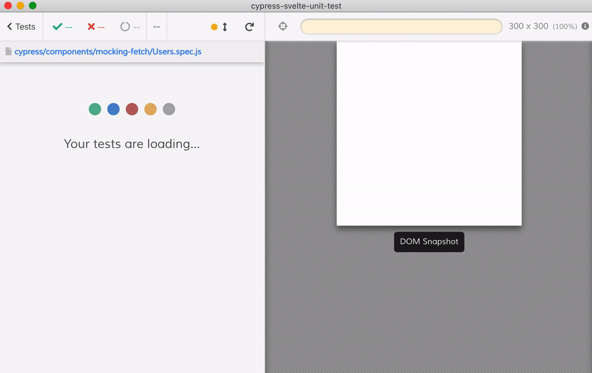

# mocking fetch example

In [Users.svelte](Users.svelte) the application is requesting a list of resources using `fetch`. See test [Users.spec.js](Users.spec.js) where we directly stub `window.fetch` using [cy.stub](https://on.cypress.io/stub)

The tests also show how to respond with mock users after a delay, which allows testing the loading DOM notification.

